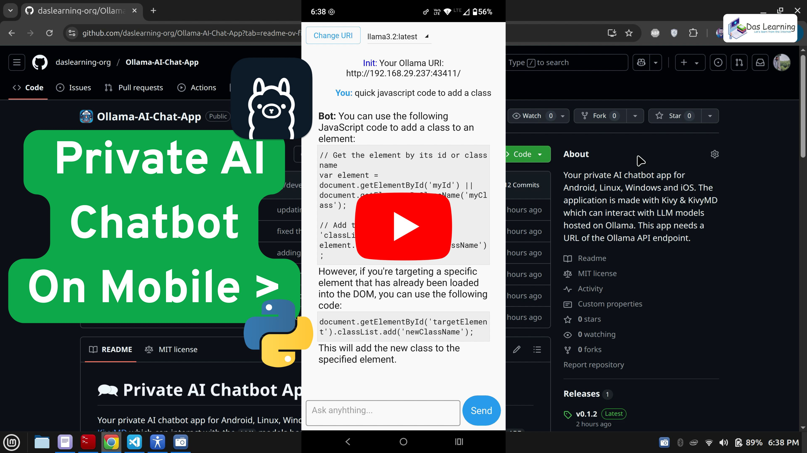
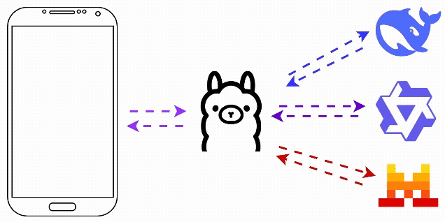

# 🗪 Private AI Chatbot App for Ollama
Your private AI chatbot app for Android, Linux, Windows and iOS. The application is made with [Kivy](https://kivy.org/) and [KivyMD](https://kivymd.readthedocs.io/en/latest/) which can interact with the `LLM` models hosted on [Ollama](https://ollama.com/). This app needs a URL of the `Ollama API` endpoint.

> Overview: The app uses KivyMD and Kivy mainly for the AI Chatbot UI and uses python requests module to perform the chat functions using the Ollama API endpoint. The Ollama can be hosted anywhere as long as the application has a network connectivity to the Ollama URL. The app can pull out the list of installed LLM models and we can choose a model from the drop-down menu at the top. Please find the installation and build steps as descried below.

## 📽️ Demo
You can click on the below Image or this [Youtube Link](https://www.youtube.com/watch?v=a-azvqDL78k) to see the demo. Please let me know in the comments, how do you feel about this App. <br>
[](https://www.youtube.com/watch?v=a-azvqDL78k)

## 🖧 Our Scematic Architecture
This is the scematic flow [diagram](./docs/images/kivyOllamaFlow.gif) <br>


## 🧑‍💻 Quickstart Guide

### 📱 Download & Run the Android App
You can check the [Releases](https://github.com/daslearning-org/Ollama-AI-Chat-App/releases) and downlaod the latest version of the android app on your phone.

### 🖳 Download & Run the Windows or Linux Application
You can check the [Releases](https://github.com/daslearning-org/Ollama-AI-Chat-App/releases) and downlaod the latest version of the application on your computer. If you are on `Windows`, download the `dasLearningChat-vX.X.X.exe` file & double click to run it. If you are on `Linux`, download `dasLearningChatLinux-vXXX` file and run it (you may need to change the permission to execute).

### 🐍 Run with Python
```bash
git clone https://github.com/daslearning-org/Ollama-AI-Chat-App.git
cd Ollama-AI-Chat-App/kivy/
pip install -r requirements.txt # virtual environment is recommended
python main.py
```

## 🦾 Build your own App
The Kivy project has a great tool named [Buildozer](https://buildozer.readthedocs.io/en/latest/) which can make mobile apps for `Android` & `iOS`

### 📱 Build Android App
A Linux environment is recommended for the app development. If you are on Windows, you may use `WSL` or any `Virtual Machine`. As of now the `buildozer` tool works on Python version `3.10` at maximum. I am going to use Python `3.9`

```bash
# add the python repository
sudo add-apt-repository ppa:deadsnakes/ppa
sudo apt update

# install all dependencies.
sudo apt install -y ant autoconf automake ccache cmake g++ gcc lbzip2 libffi-dev libltdl-dev libtool libssl-dev make openjdk-17-jdk patch pkg-config python3-dev python3-pip unzip wget zip git python3.9 python3.9-venv

# optionally you may check the java installation with below commands
java -version
javac -version

# install python modules
git clone https://github.com/daslearning-org/Ollama-AI-Chat-App.git
cd Ollama-AI-Chat-App/kivy/
python3.9 -m venv .env # create python virtual environment
source .env/bin/activate
pip install -r android-requirements.txt

# build the android apk
buildozer android debug # this may take a good amount of time for the first time & will generate the apk in the bin directory
```

### 🖳 Build Computer Application (Windows / Linux / MacOS)
A `Python` virtual environment is recommended and please follow the same steps from above till the pip module installations (do not require buildozer for desktop apps). It builds a native app depending on the OS type i.e. `.exe` if you are running `PyInstaller` from a Windows machine. Build computer apps from [docker image](https://hub.docker.com/r/cdrx/pyinstaller-windows) for any OS type.

```bash
# install pyinstaller
pip install pyinstaller

# generate the spec file
pyinstaller --name "dasLearningChat" --windowed --onefile main.py # optional as it is already create in the repo

# then update the spec file as needed
# then build your app which will be native to the OS i.e. Linux or Windows or MAC
pyinstaller dasLearningChat.spec
```

#### Build Windows exe from Linux

* Install Wine
```bash
# Add the Wine repository key
sudo mkdir -pm755 /etc/apt/keyrings
sudo wget -O /etc/apt/keyrings/winehq-archive.key https://dl.winehq.org/wine-builds/winehq.key

# Add the Wine repository for your Linux Mint version
# For Linux Mint 21.x (Vanessa, Virginia, Victoria - based on Ubuntu 22.04 Jammy Jellyfish)
# Replace 'jammy' with your Ubuntu base codename if different (e.g., 'focal' for Mint 20.x)
sudo wget -NP /etc/apt/sources.list.d/ https://dl.winehq.org/wine-builds/ubuntu/dists/jammy/winehq-jammy.sources

# Update package lists
sudo apt update

# Install Wine (Stable branch is usually recommended)
sudo apt install --install-recommends winehq-stable

# If you need 32-bit support (highly recommended for Python/PyInstaller compatibility)
# This command typically handles it, but if you encounter issues later, ensure 32-bit architecture is enabled:
sudo dpkg --add-architecture i386
sudo apt update
sudo apt install wine32 # This might be pulled by winehq-stable, but good to ensure
```

* Download Windows Python from [official page](https://www.python.org/downloads/windows/) and then install
```bash
# Navigate to where you downloaded the Python installer
cd ~/Downloads

# Run the installer using wine
# Replace 'python-3.9.13-amd64.exe' with the actual filename you downloaded
wine python-3.9.13-amd64.exe
```

* Then run the development
```bash
cd kivy/
wine pip install pyinstaller
wine pip install -r requirements.txt
# Also install kivy-deps.sdl2, kivy-deps.glew, kivy-deps.angle explicitly if not pulled by Kivy/KivyMD
wine pip install kivy-deps.sdl2 kivy-deps.glew kivy-deps.angle

# Replace 'Python39' with your installed Python version in Wine
wine pyinstaller dasLearningChat.spec # exe will be in the dist folder
```
